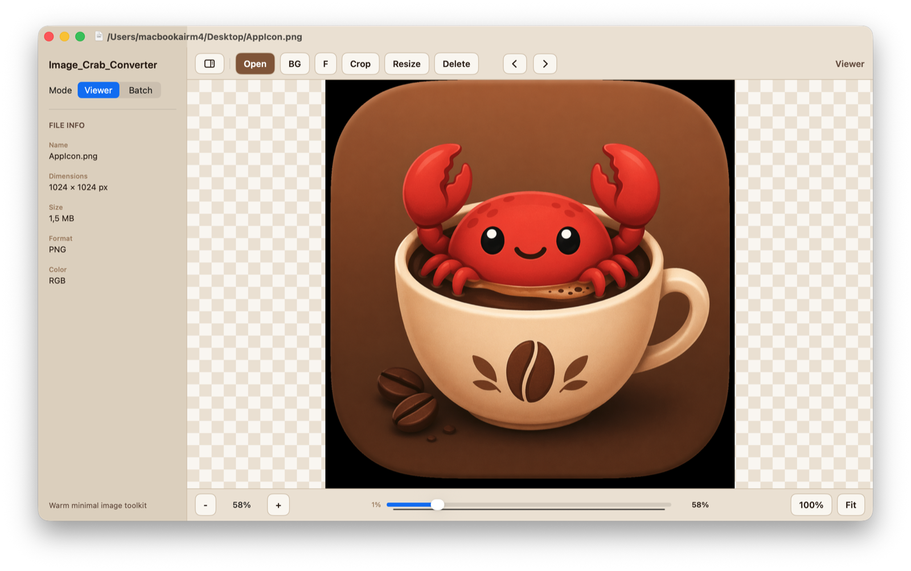
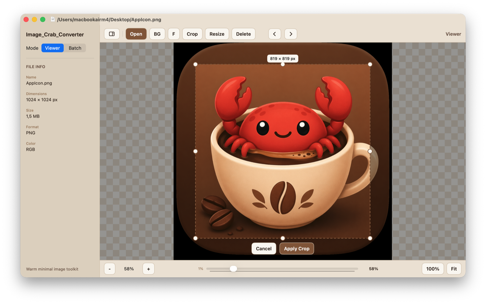
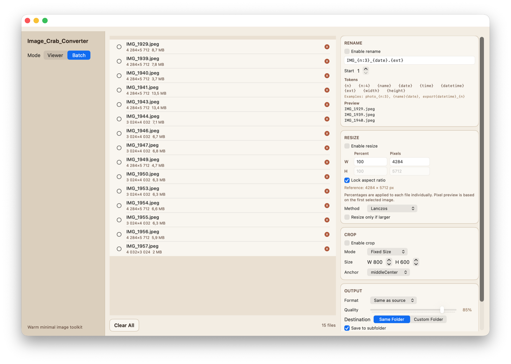

# Image Crab Converter

A native macOS image viewer and batch converter built with SwiftUI + AppKit. Supports viewing, cropping, resizing, format conversion, and batch processing with a warm coffee-toned UI.

## Screenshots

### Viewer



### Crop



### Batch Processing



## Features

### Image Viewer
- View images with smooth zoom from 1% to 3200%
- Pan and scroll through large images with drag support
- Navigate between images in a folder with arrow keys or spacebar
- Fullscreen canvas mode (press `F`)
- Checkerboard or black canvas background
- EXIF metadata display

### Single Image Editing
- **Crop** — interactive overlay with drag handles, real-time pixel dimensions
- **Resize** — by pixels or percentage, with aspect ratio lock
- Non-destructive: saves as a new file with timestamp suffix

### Batch Processing
- **Rename** — pattern engine with tokens:
  - `{n}` / `{n:4}` — sequential number (with zero-padding)
  - `{name}` — original filename
  - `{date}`, `{time}`, `{datetime}` — timestamp
  - `{ext}` — file extension
  - `{width}`, `{height}` — image dimensions
- **Resize** — batch resize by pixels or percentage, aspect ratio lock
- **Crop** — fixed size or ratio crop with configurable anchor point
- **Convert** — change output format and quality
- Per-file live status tracking (idle / processing / success / error / cancelled)
- Cancellable batch operations

### Supported Formats

| Format | Input | Output |
|--------|:-----:|:------:|
| JPEG   |  yes  |  yes   |
| PNG    |  yes  |  yes   |
| HEIC   |  yes  |  yes   |
| TIFF   |  yes  |  yes   |
| GIF    |  yes  |  yes   |
| BMP    |  yes  |  yes   |
| WebP   |  yes  |  yes   |
| PDF    |  yes  |   —    |
| RAW    |  yes  |   —    |

## Keyboard Shortcuts

| Action          | Shortcut   |
|-----------------|------------|
| Open file       | `Cmd+O`    |
| Zoom in         | `Cmd+=`    |
| Zoom out        | `Cmd+-`    |
| Actual size     | `Cmd+0`    |
| Fit to window   | `Cmd+Shift+0` |
| Crop            | `Cmd+K`    |
| Resize          | `Cmd+R`    |
| Next image      | `→` or `Space` |
| Previous image  | `←`        |
| Fullscreen      | `F`        |

## Requirements

- **macOS 14** (Sonoma) or later
- **Swift 6.0**
- No external dependencies — pure Apple frameworks (AppKit, SwiftUI, ImageIO)

## Build from Source

```bash
git clone https://github.com/dixinode/Image-Crab-Converter.git
cd Image-Crab-Converter
swift build -c release
```

The built app will be at `.build/release/Image_Crab_Converter`.

## Install

Download the latest `.dmg` from [Releases](https://github.com/dixinode/Image-Crab-Converter/releases) and drag the app to your Applications folder.

## Project Structure

```
Sources/
  ImageCrabConverterCore/     # Core library — format conversion, batch processing
    Models/                   # ImageDocument, BatchJob, CropRegion
    Services/                 # ImageProcessor, BatchProcessor, FileRenamer
  Image_Crab_Converter/       # SwiftUI app
    App/                      # App entry point, AppDelegate
    ViewModels/               # ViewerViewModel, BatchViewModel
    Views/
      Viewer/                 # Image canvas, crop overlay, resize sheet
      Batch/                  # Batch UI — file list, progress, settings
      Shared/                 # Sidebar, buttons, section headers
    Theme/                    # CoffeePalette design system
```

## License

MIT
